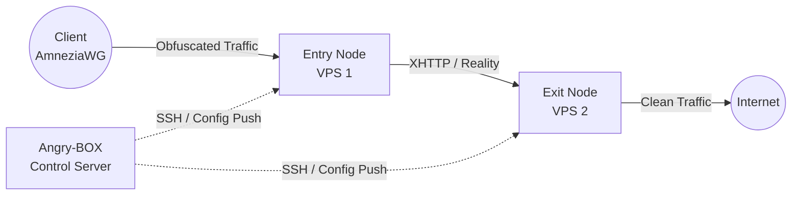

<div align="center">
  
  <h1>Angry-BOX</h1>
  <p><strong>The Ultimate Automated Proxy Orchestrator for sing-box-extended</strong></p>

  <p>
    <a href="https://github.com/AlexeyLCP/angry-box/releases"></a>
    <a href="https://golang.org"></a>
    <a href="LICENSE"></a>
  </p>
  <p>
    <i>Build impenetrable multi-hop, heavily obfuscated VPN chains with zero manual configuration.</i>
  </p>
</div>

---

**[🇬🇧 English](README.md) | [🇷🇺 Русский](README_ru.md) | [🇨🇳 简体中文](README_zh.md) | [🇮🇷 فارسی](README_fa.md)**

## 🚀 Overview

**Angry-BOX** is an advanced, lightweight orchestrator designed to fully automate the deployment, configuration, and management of anti-DPI proxy nodes across multiple servers. 

Built exclusively around **[sing-box-extended](https://github.com/shtorm-7/sing-box-extended)**, Angry-BOX seamlessly configures complex proxy topologies (such as multi-hop chains with `VLESS-Reality`, `XHTTP`, and `AmneziaWG`) directly over SSH, removing all the friction from setting up robust, censorship-resistant infrastructure.

## ✨ Features

- **Automated Orchestration:** No need to manually write complex `sing-box` JSON configs. Angry-BOX generates, validates, and deploys configs over SSH in seconds.
- **Advanced Obfuscation Protocols:** Native support for `AmneziaWG`, `XHTTP`, `VLESS-Reality`, and `Hysteria2`.
- **Multi-Hop Chains:** Easily construct 2-node or 3-node proxy chains to route traffic securely through multiple jurisdictions.
- **Failover & Load Balancing:** Built-in support for `urltest`, `failover`, and `selector` strategies.
- **Modern Web UI:** Control everything from a sleek, responsive dashboard built with HTMX and TailwindCSS (protected by automatic authentication).
- **100% Independent:** Angry-BOX stores all critical dependencies (like `sing-box-extended` binaries and `amneziawg` kernel modules) locally, ensuring your deployments won't break if third-party repos go down.
- **Zero-Footprint:** Node servers only run the bare `sing-box` core. The orchestrator lives entirely on your control machine.

## 📸 Screenshots

<div align="center">
  
  <br>
  <em>The Angry-BOX Web UI Dashboard</em>
</div>

## 🏗 Architecture

Unlike traditional panels that require heavy agents on every server, Angry-BOX takes a **stateless agentless approach**:



## 🛠 Getting Started

### 1. Installation

Download the latest release for your platform (Linux/Windows/macOS) from the [Releases](https://github.com/AlexeyLCP/angry-box/releases) page, or run the convenient install script:

```bash
curl -fsSL https://raw.githubusercontent.com/AlexeyLCP/angry-box/main/scripts/install.sh | sh
```

### 2. Starting the Daemon (Web UI)

Run Angry-BOX as a systemd service, or start it manually:

```bash
angry-box serve -listen 0.0.0.0:8090
```

*Note: On the first run, a random secure password will be generated for the Web UI. Check your console logs or `journalctl -u angry-box` to find it.*

### 3. CLI Quick Start

You can orchestrate your network entirely via CLI:

```bash
# 1. Add your VPS nodes
angry-box host add entry-node --addr 1.2.3.4:22 --user root --key ~/.ssh/id_ed25519
angry-box host add exit-node --addr 5.6.7.8:22 --user root --key ~/.ssh/id_ed25519

# 2. Deploy sing-box core to the nodes
angry-box deploy -addr 1.2.3.4 -key ~/.ssh/id_ed25519
angry-box deploy -addr 5.6.7.8 -key ~/.ssh/id_ed25519

# 3. Create a chain using AmneziaWG entry and XHTTP transport
angry-box chain create my-chain --nodes entry-node,exit-node --user-protocol awg --transport xhttp

# 4. Apply the chain to generate and push configs automatically!
angry-box apply-chain my-chain
```

Angry-BOX will output a **ready-to-use AmneziaWG client configuration block** right in the console!

## 📜 Third-Party Open Source Components

Angry-BOX stands on the shoulders of giants. We would like to acknowledge and thank the following projects that make this orchestrator possible:

- **[sing-box](https://github.com/SagerNet/sing-box)** and **[sing-box-extended](https://github.com/shtorm-7/sing-box-extended)** (Licensed under GPLv3)
- **[AmneziaWG Linux Kernel Module](https://github.com/amnezia-vpn/amneziawg-linux-kernel-module)** (Licensed under GPLv2)
- **HTMX, TailwindCSS, and DaisyUI** (MIT / BSD Licenses)

Please see the [LICENSE](LICENSE) file for the full copyright notices and licensing details of these components.

## 📄 License

This project is licensed under the **PolyForm Noncommercial License 1.0.0**.

**This means you are free to use Angry-BOX for personal, educational, and research purposes.** 
*Any commercial use (e.g., selling VPN services based on this orchestration, offering SaaS, etc.) is STRICTLY PROHIBITED without direct written permission from the author.*