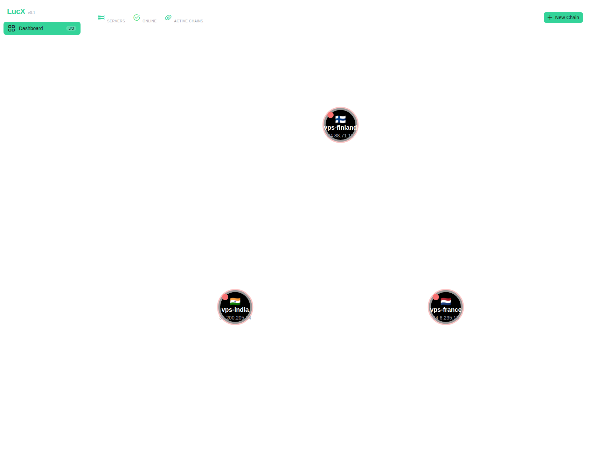
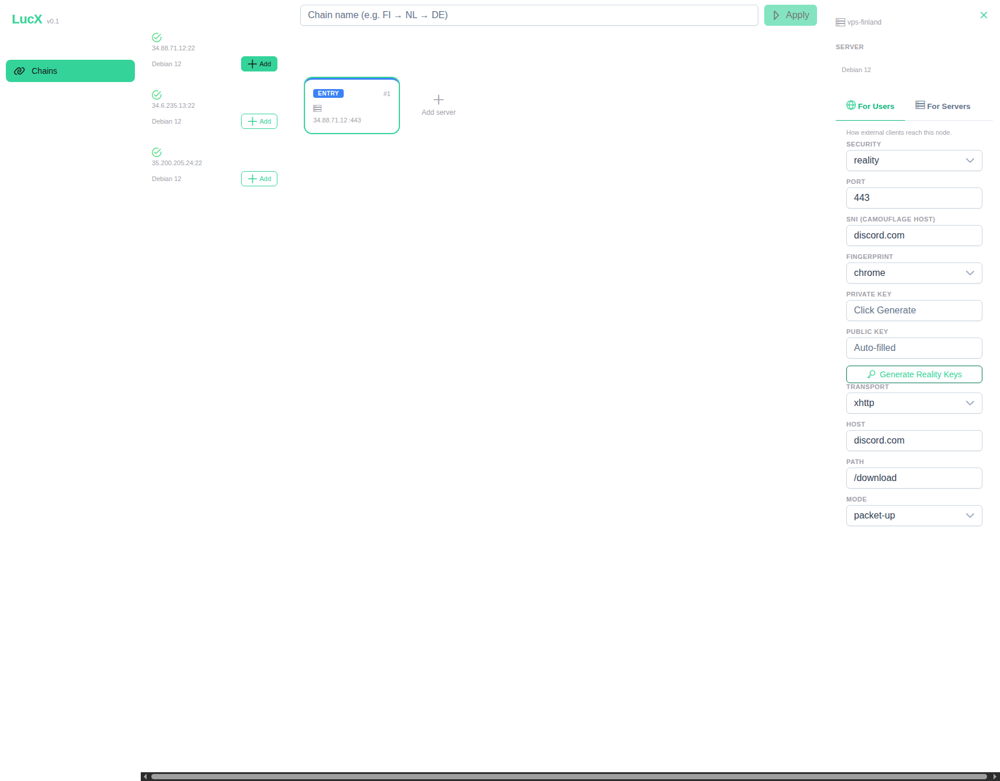
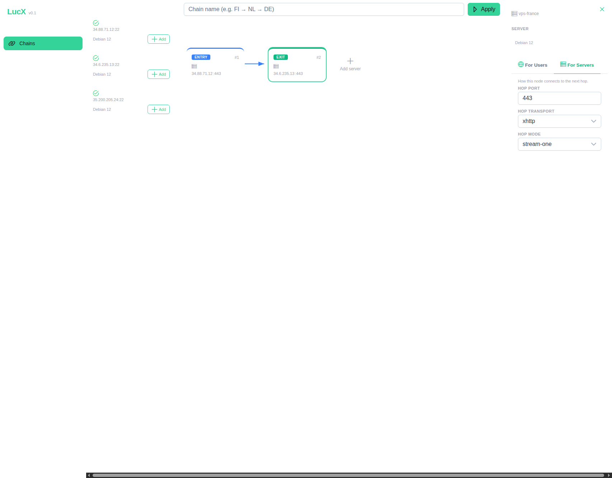
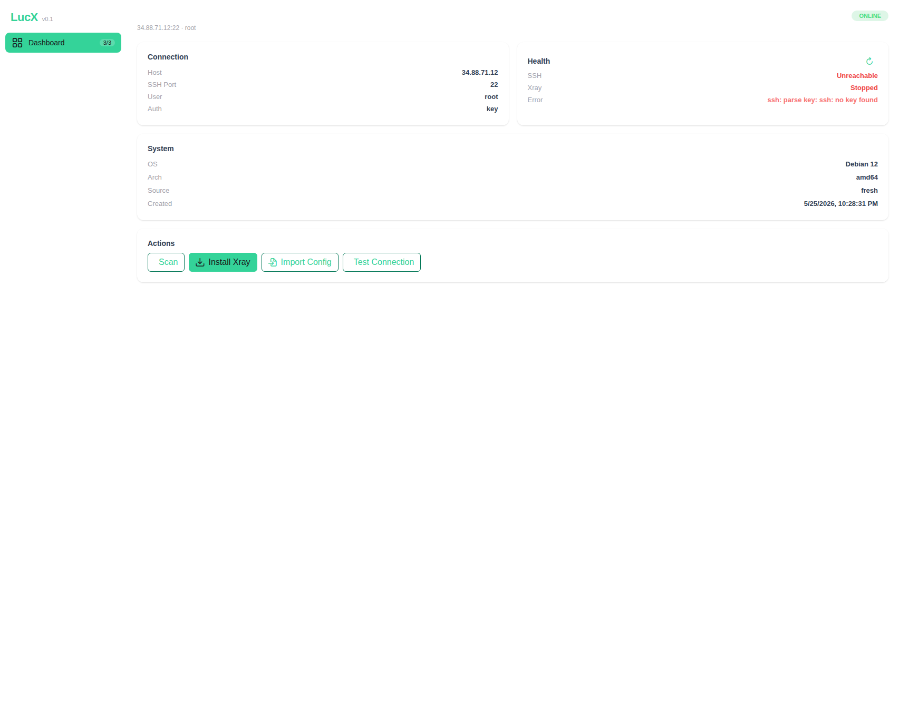

<h1 align="center">LucX</h1>

<p align="center">
  <strong>Personal Multi-Hop Xray Orchestrator</strong><br>
  <sub>Build. Deploy. Route. One binary, zero bullshit.</sub>
</p>

<p align="center">
  <a href="https://pkg.go.dev/github.com/alexeylcp/lucx-core"></a>
  <a href="https://vuejs.org"></a>
  <a href="https://github.com/AlexeyLCP/lucx/blob/main/LICENSE"></a>
  <a href="#"></a>
  <a href="#"></a>
</p>

---

**LucX** is a personal tool for building and managing multi-hop VLESS+XHTTP proxy chains. It auto-installs Xray-core on remote servers via SSH, manages their configuration, and provides a visual chain builder — all from a single binary.

Designed for one person, one operator. No multi-tenancy. No user management. No commercial support.

---

## Features

- **Visual Chain Builder** — drag-and-drop interface to construct multi-hop proxy chains with live topology visualization
- **One Binary, Zero Dependencies** — Go binary embeds the Vue 3 SPA and SQLite database. Copy to a VPS, run, open browser
- **Safe Config Management** — 7-step apply pipeline: backup → merge → atomic write → `xray run -test` → restart → verify ports. Automatic rollback on failure
- **Existing Config Aware** — detects and preserves non-LucX inbounds on merge. Imports standalone Xray installs. Port conflict validation prevents accidents
- **Multi-Platform** — works on VPS (amd64/arm64), ARM routers (armv7), and MIPS routers (mipsle). UPX compression for storage-constrained devices
- **SSH-Based** — password and key auth. All server communication goes through SSH. No agents, no custom daemons
- **Reality-Ready** — VLESS+Reality+XHTTP presets with one-click key generation. Built-in `xray x25519` on remote hosts
- **WebSocket Progress** — real-time feedback during chain apply, with per-server status and log streaming

### Protocols and Transports

| Axis | Supported |
|------|-----------|
| **Protocol** | VLESS, Trojan, VMess, Shadowsocks |
| **Security** | Reality, TLS, none |
| **Transport** | XHTTP (default, v26+), WebSocket, gRPC, HTTP/2, QUIC, TCP |
| **Backends** | Xray-core v26+ (AmneziaWG, sing-box, Hysteria2, TUIC planned) |

---

## Screenshots

<p align="center">
  <strong>Dashboard — Topology Map</strong><br>
  
</p>

<p align="center">
  <strong>Chain Builder — Canvas + Server Palette + Node Inspector</strong><br>
  
</p>

<p align="center">
  <strong>Node Inspector — "For Servers" Tab</strong><br>
  
</p>

<p align="center">
  <strong>Server Detail — Health Check, Actions, System Info</strong><br>
  
</p>

---

## Quick Start

Requirements: a Linux machine (VPS, home server, or router) with Go 1.24+ and Node.js 22+ for building, or just grab a pre-built binary from releases.

```bash
# Clone
git clone https://github.com/AlexeyLCP/lucx.git
cd lucx

# Build (runs Go tests, builds Vue SPA, compiles binary)
./scripts/build.sh
# Or: make build

# Run — bind to port 80 for convenience
./build/lucx-core -listen :80 -db ./lucx.db

# Open http://<your-server-ip> in your browser
# Login password is the JWT secret: lucx-dev-secret-change-me
```

Change the password immediately (the login password IS the JWT secret):

```bash
./build/lucx-core -listen :80 -db ./lucx.db -jwt-secret "$(openssl rand -hex 32)"
```

Add your first server from the Dashboard, scan it, install Xray, and start building chains.

---

## Installation

### VPS (Recommended)

The simplest deployment — copy the binary and run:

```bash
# On your local machine, build and copy
make cross                      # builds for amd64, arm64, mipsle, armv7
scp build/lucx-core-linux-amd64 root@your-vps:/usr/local/bin/lucx-core
ssh root@your-vps

# On the VPS
chmod +x /usr/local/bin/lucx-core
/usr/local/bin/lucx-core -listen :80 -db /var/lib/lucx/lucx.db -jwt-secret "$(openssl rand -hex 32)"
```

For persistence, create a systemd unit:

```ini
# /etc/systemd/system/lucx-core.service
[Unit]
Description=LucX Orchestrator
After=network-online.target
Wants=network-online.target

[Service]
Type=simple
ExecStart=/usr/local/bin/lucx-core -listen 127.0.0.1:8744 -db /var/lib/lucx/lucx.db
Restart=always
RestartSec=5
Environment=LU_JWT_SECRET=change-me-to-a-random-string

[Install]
WantedBy=multi-user.target
```

Then put nginx or Caddy in front with TLS. The binary itself doesn't handle HTTPS — proxy it.

### OpenWrt

Build for your router's architecture and copy:

```bash
# For ARMv7 routers
make cross-armv7
scp build/lucx-core-linux-armv7 root@192.168.1.1:/usr/bin/lucx-core

# For MIPS Big Endian (older OpenWrt)
make cross-mips
scp build/lucx-core-openwrt-mips root@192.168.1.1:/usr/bin/lucx-core

# Compress with UPX for storage-constrained devices
make router-builds
```

The binary needs ~15-20 MB of storage. With UPX `--best`, it compresses to ~8-10 MB.

### Keenetic Routers

Keenetic runs NDMS (Network Device Management System) with OPKG/Entware for user packages. LucX provides pre-built binaries for both MIPSel (primary) and MIPS Big Endian architectures, plus `.ipk` packages for native OPKG installation.

**Architecture mapping:**

| Keenetic Model | Architecture | Target |
|---------------|-------------|--------|
| Ultra, Giga, Hopper | MIPSel | `keenetic-mipsel` |
| Older models (pre-2021) | MIPS BE | `openwrt-mips` |
| Speedster, Skipper | ARMv7 | `linux-armv7` |

**Build for Keenetic:**

```bash
# Build both MIPS targets + UPX compression
make keenetic

# Or build with .ipk package
make keenetic-package
```

**Installation methods:**

*Method 1 — OPKG (.ipk package, recommended):*

```bash
# Copy .ipk to router
scp build/lucx-core_*_mipsel.ipk root@<keenetic>:/opt/tmp/

# SSH to router and install
ssh root@<keenetic>
opkg install /opt/tmp/lucx-core_*_mipsel.ipk
/opt/etc/init.d/S99lucx start
```

*Method 2 — Manual binary copy:*

```bash
scp build/lucx-core-keenetic-mipsel root@<keenetic>:/opt/bin/lucx-core
ssh root@<keenetic>
chmod +x /opt/bin/lucx-core

# Run manually
/opt/bin/lucx-core -listen :8744 -db /opt/var/run/lucx.db &

# Auto-start: add to /opt/etc/init.d/S99lucx
```

*Method 3 — Tarball with install script:*

```bash
scp build/lucx-core-*-keenetic-mipsel.tar.gz root@<keenetic>:/opt/tmp/
ssh root@<keenetic>
cd /opt/tmp && tar xzf lucx-core-*-keenetic-mipsel.tar.gz
cd lucx-core-*-keenetic-mipsel && chmod +x install.sh && ./install.sh
```

**NDMS-specific paths:**

| Path | Purpose |
|------|---------|
| `/opt/bin/` | User binaries (in `$PATH` by default) |
| `/opt/etc/init.d/` | Startup scripts (`S99*` = start on boot) |
| `/opt/var/run/` | Runtime data — database, sockets, PID files |
| `/opt/tmp/` | Temporary files (package staging) |

**MIPS-specific ldflags:**

For Keenetic builds, additional linker flags reduce binary size and improve stability:

| Flag | Effect |
|------|--------|
| `-s` | Strip debug info |
| `-w` | Strip DWARF symbol table |
| `-buildid=` | Remove Go build ID |
| `-trimpath` | Reproducible builds |
| `GOMIPS=softfloat` | Software FPU emulation (no hardware float on MIPS) |

**Resource usage on Keenetic:**

| Metric | Typical |
|--------|---------|
| Binary size (upx) | ~8-10 MB |
| RAM at idle | ~15-25 MB |
| CPU usage idle | <1% |
| Storage (binary + DB) | ~12-15 MB |

> **Note:** LucX on Keenetic works best with an external USB drive (Entware on `/opt`). The built-in flash may be too small for the binary. Ensure `/opt` has at least 30 MB free.

### Docker

```dockerfile
FROM alpine:3.21
COPY build/lucx-core-linux-amd64 /usr/local/bin/lucx-core
RUN apk add --no-cache ca-certificates
EXPOSE 8744
VOLUME /data
ENTRYPOINT ["/usr/local/bin/lucx-core", "-listen", ":8744", "-db", "/data/lucx.db"]
```

```bash
docker build -t lucx .
docker run -d --name lucx \
  -p 8744:8744 \
  -v lucx-data:/data \
  -e LU_JWT_SECRET=change-me \
  lucx
```

> **Note:** LucX manages remote servers over SSH, but doesn't run SSH itself. The Docker container needs no SSH access — it's an *outbound* SSH client to your proxy servers.

---

## Usage

### 1. Register Servers

Add each server you want to use as a hop:

```
Dashboard → Add Server → enter IP, SSH credentials, name
```

Supported auth: password or SSH private key. The key is stored encrypted at rest in SQLite and never exposed in API responses.

### 2. Scan and Install

Each server goes through a lifecycle:

| State | Meaning |
|-------|---------|
| **unknown** | Newly added, not yet scanned |
| **scanned** | Pre-install check passed |
| **online** | Xray installed, running, managed by LucX |
| **imported** | Existing Xray found, imported (not managed) |

```
Server Detail → Scan → Install Xray → Health Check
```

LucX downloads and installs Xray-core using the official XTLS install script. Existing configs are detected and preserved.

### 3. Build a Chain

```
Chains → New Chain → drag servers from the palette to the canvas
```

Each chain is a sequence of nodes:

| Role | What it does | Configures |
|------|-------------|------------|
| **Entry** | Client-facing inbound | VLESS+Reality, port, SNI, keys |
| **Hop** | Internal relay | Inter-server forwarding port |
| **Exit** | Final outbound | Egress port, optional routing rules |

Configure each node in the inspector, then:

```
Apply → review the plan → confirm
```

If any server fails, the entire chain rolls back — all servers restore their previous config automatically.

### 4. Get Connection Link

Once applied, copy the `vless://` link from the chain and import it into any Xray client (v2rayNG, Nekoray, Streisand, FoxRay, etc.).

```bash
# CLI alternative — apply chain and print config in one command
./lucx-core -apply-chain <chain-id> -db ./lucx.db
```

---

## Architecture

```
┌──────────────────────────────────────────────────────┐
│                    Web Browser                         │
│               (Vue 3 SPA + PrimeVue 4)                 │
└─────────────────────┬────────────────────────────────┘
                      │ REST + WebSocket
                      │ (single port, default :8744)
┌─────────────────────▼────────────────────────────────┐
│                 lucx-core binary                       │
│  ┌──────────┐  ┌──────────┐  ┌────────────────────┐  │
│  │  chi API │  │  Chain   │  │  Config Manager    │  │
│  │  handlers│  │  Engine  │  │  (backup→merge→    │  │
│  │          │  │          │  │   write→test→       │  │
│  │  JWT     │  │  plan→   │  │   restart→verify)   │  │
│  │  auth    │  │  validate│  │                    │  │
│  │          │  │  →execute│  │                    │  │
│  └──────────┘  └──────────┘  └────────────────────┘  │
│                      │                                 │
│              ┌───────▼────────┐                        │
│              │    SQLite       │                       │
│              │ (WAL mode,      │                       │
│              │  CGo-free)      │                       │
│              └────────────────┘                        │
└─────────────────────┬────────────────────────────────┘
                      │ SSH (password or key)
         ┌────────────┼────────────┐
         ▼            ▼            ▼
   ┌──────────┐ ┌──────────┐ ┌──────────┐
   │ Server 1 │ │ Server 2 │ │ Server 3 │
   │ Xray v26 │ │ Xray v26 │ │ Xray v26 │
   │ (entry)  │ │  (hop)   │ │  (exit)  │
   └──────────┘ └──────────┘ └──────────┘
```

### Key Design Decisions

**Config-file-only management.** Xray v26's gRPC API for runtime config changes is unreliable. LucX manages config.json directly through a safe 7-step pipeline: backup current → merge changes → atomic write (tmp + rename) → `xray run -test` → systemctl restart → verify each port is listening.

**All-or-nothing apply with rollback.** A chain spans multiple servers. If any server fails during apply, every server that already received changes gets rolled back to its backup. Partial state is impossible.

**Idempotent re-apply.** Applying an already-active chain is a no-op (returns 200). Changing a node resets the chain to "draft" — apply again to push the update.

**Embedded SPA, single port.** In production, the Go binary serves both the REST API and the compiled Vue frontend on one port. No CORS, no reverse proxy required (though recommended for TLS).

### Database

Four SQLite tables, WAL mode with foreign keys:

- **`servers`** — SSH targets (host, port, credentials, status)
- **`server_backends`** — installed backends per server (type, version, managed flag)
- **`chains`** — chain definitions (name, status)
- **`chain_nodes`** — nodes within a chain (role, protocol, inbound/outbound specs)

No migrations framework — schema changes handled in `store.migrate()` with `PRAGMA table_info` guards.

### Project Map

```
cmd/lucx-core/           Entry point, CLI modes, HTTP server
internal/
  api/                   REST handlers (chi router, JWT auth, WebSocket)
  backend/               Abstract proxy backend interface + Xray implementation
  chain/                 Plan → validate → execute → commit pipeline
  config/                CLI flag parsing
  ssh/                   SSH client (connect, exec, read/write files)
  store/                 SQLite data access layer
  scanner/               Pre-install checks, existing config detection
  reality/               X25519 key generation via remote xray binary
  health/                Server + backend health checking
  ws/                    WebSocket hub for real-time progress broadcast
lucx-web/                Vue 3.5 SPA (PrimeVue 4, Pinia, TypeScript)
scripts/build.sh         CI/CD build script
```

---

## Development

```bash
# Full-stack dev mode: Go API on :8744 + Vite HMR on :5173
make dev

# Backend only
go run ./cmd/lucx-core/ -listen :8744 -db ./lucx.db

# Frontend only (proxies /api to :8744)
cd lucx-web && npm run dev

# Tests
make test            # go vet + go test
make cross           # cross-compile 4 targets (amd64, arm64, armv7, mipsle)
make build-all       # all 5 targets including MIPS Big Endian
make keenetic        # Keenetic-specific: mipsle + mips + UPX
make keenetic-package  # Keenetic .ipk + tarball
make release         # full pipeline: test + web + build-all + packages

# Individual targets
make cross-amd64     # linux/amd64
make cross-arm64     # linux/arm64
make cross-armv7     # linux/arm/v7
make cross-mipsle    # linux/mipsle (Keenetic primary)
make cross-mips      # linux/mips (Big Endian)

# Full CI build
./scripts/build.sh
```

---

## FAQ

**Why not use Xray's gRPC API for config changes?**

We tried. Xray v26.3.27's `HandlerService.AddInbound` gRPC API returns success but the inbound never appears in the running config. The config-file approach with `xray run -test` is reliable and has been battle-tested across thousands of apply cycles.

**Is this a commercial VPN panel?**

No. LucX is a personal orchestrator. It has no user management, no billing, no multi-tenancy, no reseller features. There are excellent commercial panels for that — this isn't one of them.

**Can I chain servers from different providers?**

Yes. LucX doesn't care where your servers are — GCP, AWS, Hetzner, your Raspberry Pi at home. As long as they run Linux and you can SSH in, they work.

**What about censorship circumvention?**

LucX is a research tool for studying multi-hop proxy topologies. It is not marketed as, designed as, or intended to be a censorship circumvention tool. Follow the laws of your jurisdiction.

**Does it work on Windows?**

The binary runs on Linux. The Web UI works in any modern browser. You can run LucX on a Linux VPS and access it from Windows.

---

## Donations

LucX is a solo-maintained project built for personal use. If it's useful to you, donations help cover test infrastructure and development time.

<p align="center">

| Method | Address |
|--------|---------|
| **ЮMoney** | [yoomoney.ru/to/41001989176429](https://yoomoney.ru/to/41001989176429) |
| **ERC-20** | `0xA49aBc042c5BB3d682788D3DEB2eAC833343a873` |

</p>

All donations go directly to the maintainer. No foundation, no overhead, no bullshit.

---

## License

**[PolyForm Noncommercial 1.0.0](LICENSE)**

Personal, educational, and research use is free. Commercial use — including selling access, embedding in paid products, or offering LucX as a managed service — requires explicit permission from the author.

---

## Disclaimer

LucX is a **personal research tool** for studying multi-hop proxy architectures and Xray-core configuration management. It is:

- Designed for one operator managing their own infrastructure
- Built for academic interest in fault-tolerant config management
- Not intended for, tested for, or marketed for any illegal purpose

The author assumes no liability for how you use this software. Know your local laws. Use responsibly.

---

<!-- RUSSIAN -->

## Русский

**LucX** — персональный оркестратор мультихоп прокси-цепочек на базе Xray-core. Один бинарник, веб-интерфейс, визуальный построитель цепочек.

### Быстрый старт

```bash
git clone https://github.com/AlexeyLCP/lucx.git && cd lucx
./scripts/build.sh
./build/lucx-core -listen :80 -db ./lucx.db
# Открыть http://<ваш-сервер> в браузере, пароль: lucx-dev-secret-change-me
```

### Установка на VPS

Собрать бинарник, скопировать на сервер, запустить:

```bash
make cross
scp build/lucx-core-linux-amd64 root@ваш-vps:/usr/local/bin/lucx-core
ssh root@ваш-vps
/usr/local/bin/lucx-core -listen :80 -db /var/lib/lucx/lucx.db
```

Рекомендуется завернуть в systemd и поставить nginx/Caddy с TLS перед бинарником.

### Установка на роутер (OpenWrt / Keenetic)

**Keenetic (основная цель):**

```bash
# Собрать бинарники для Keenetic (MIPSel + MIPS BE) с UPX-сжатием
make keenetic-package

# Способ 1: OPKG-пакет (рекомендуется)
scp build/lucx-core_*_mipsel.ipk root@<keenetic>:/opt/tmp/
ssh root@<keenetic>
opkg install /opt/tmp/lucx-core_*_mipsel.ipk

# Способ 2: Бинарник вручную
scp build/lucx-core-keenetic-mipsel root@<keenetic>:/opt/bin/lucx-core
ssh root@<keenetic> && chmod +x /opt/bin/lucx-core

# Способ 3: Tarball с инсталлятором
scp build/lucx-core-*-keenetic-mipsel.tar.gz root@<keenetic>:/opt/tmp/
ssh root@<keenetic> && cd /opt/tmp && tar xzf lucx-core-*.tar.gz
cd lucx-core-* && ./install.sh
```

**OpenWrt / ARM-роутеры:**

```bash
make cross-armv7  # для ARMv7
scp build/lucx-core-linux-armv7 root@192.168.1.1:/usr/bin/lucx-core
```

С UPX-сжатием бинарник занимает ~8-10 МБ. Для Keenetic требуется Entware на внешнем USB-накопителе. Пути NDMS: `/opt/bin/` (бинарники), `/opt/etc/init.d/` (автозапуск), `/opt/var/run/` (база данных).

### Как пользоваться

1. **Добавить серверы** — Dashboard → Add Server (IP, SSH-доступ)
2. **Сканировать и установить** — Server Detail → Scan → Install Xray → Health Check
3. **Построить цепочку** — Chains → New Chain → перетащить серверы на холст, настроить Entry/Hop/Exit
4. **Применить** — Apply, подтвердить план. При ошибке — автоматический откат.
5. **Скопировать ссылку** — скопировать `vless://` и импортировать в клиент.

### Архитектура

Один Go-бинарник содержит API-сервер (chi), движок цепочек и встроенный Vue 3 SPA. База данных — SQLite в WAL-режиме. Управление серверами — через SSH (пароль или ключ). Конфигурация Xray применяется через безопасный 7-шаговый пайплайн с автоматическим откатом.

### Дисклеймер

LucX — **инструмент для личных исследований**. Не коммерческий VPN-сервис. Не предназначен для обхода блокировок. Соблюдайте законы вашей страны.

---

<!-- CHINESE -->

## 中文简述

**LucX** — 个人多跳代理编排器。基于 Xray-core，单个二进制文件，内含 Web 界面和可视化链构建器。

### 快速开始

```bash
git clone https://github.com/AlexeyLCP/lucx.git && cd lucx
./scripts/build.sh
./build/lucx-core -listen :80 -db ./lucx.db
# 浏览器打开 http://<你的服务器IP>，密码: lucx-dev-secret-change-me
```

### 主要功能

- **可视化构建器** — 拖拽服务器卡片构建多跳链，实时拓扑图
- **单文件部署** — Go 二进制文件内嵌 Vue 3 前端 + SQLite 数据库
- **安全配置管理** — 备份 → 合并 → 原子写入 → 测试 → 重启 → 验证，失败自动回滚
- **多平台** — 支持 VPS (amd64/arm64)、ARM/MIPS 路由器
- **Reality 协议** — VLESS+Reality+XHTTP 预设，一键生成密钥

### 工作流程

1. 注册服务器（SSH 密码或密钥认证）
2. 扫描并安装 Xray-core
3. 拖拽构建多跳链（Entry → Hop → Exit）
4. 应用配置，复制 `vless://` 链接到客户端

### 许可与声明

PolyForm Noncommercial 许可。个人、教育、研究用途免费。商业用途需授权。

本工具仅供学习和研究多跳代理架构使用。请遵守当地法律。

---

<!-- END_I18N -->

© 2026 LucX Project. Built with Go, Vue, and pragmatism.