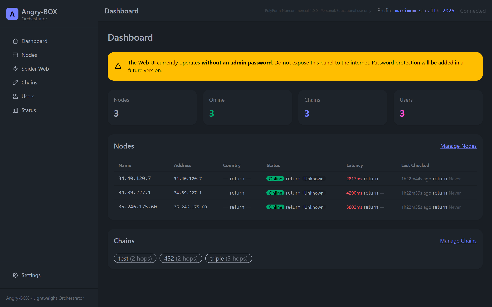
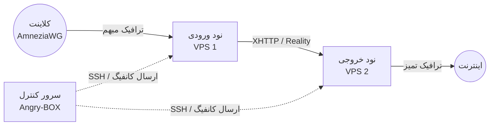

<div align="center">
  
  <h1>Angry-BOX</h1>
  <p><strong>ابزار نهایی و خودکار برای مدیریت و هماهنگ‌سازی sing-box-extended</strong></p>

  <p>
    <a href="https://github.com/AlexeyLCP/angry-box/releases"></a>
    <a href="https://golang.org"></a>
    <a href="LICENSE"></a>
  </p>
  <p>
    <i>ایجاد زنجیره‌های VPN غیرقابل نفوذ، با مبهم‌سازی ترافیک و بدون نیاز به کانفیگ دستی.</i>
  </p>
</div>

---

<div dir="rtl">

**[🇬🇧 English](README.md) | [🇷🇺 Русский](README_ru.md) | [🇨🇳 简体中文](README_zh.md) | [🇮🇷 فارسی](README_fa.md)**

## 🚀 معرفی

**Angry-BOX** یک ابزار پیشرفته و سبک برای استقرار، پیکربندی و مدیریت نودهای پراکسی (ضد فیلترینگ / Anti-DPI) در چندین سرور به صورت کاملاً خودکار است.

این ابزار که منحصراً بر پایه **[sing-box-extended](https://github.com/shtorm-7/sing-box-extended)** ساخته شده، توپولوژی‌های پیچیده پراکسی (مانند زنجیره‌های چندمرحله‌ای با `VLESS-Reality`، `XHTTP` و `AmneziaWG`) را مستقیماً از طریق SSH پیاده‌سازی می‌کند و تمام چالش‌های راه‌اندازی یک شبکه مقاوم در برابر فیلترینگ را از بین می‌برد.

## ✨ ویژگی‌ها

- **هماهنگ‌سازی خودکار:** دیگر نیازی به نوشتن دستی کانفیگ‌های پیچیده JSON برای `sing-box` نیست. Angry-BOX کانفیگ‌ها را تولید، تأیید و در چند ثانیه از طریق SSH مستقر می‌کند.
- **پروتکل‌های پیشرفته مبهم‌سازی (Obfuscation):** پشتیبانی داخلی از `AmneziaWG`، `XHTTP`، `VLESS-Reality` و `Hysteria2`.
- **زنجیره‌های چند مرحله‌ای (Multi-Hop):** ساخت آسان زنجیره‌های پراکسی ۲ یا ۳ نودی برای عبور امن ترافیک از چندین حوزه قضایی جهت حفظ حداکثر حریم خصوصی.
- **تغییر مسیر خودکار (Failover) و بالانس کردن ترافیک:** پشتیبانی داخلی از استراتژی‌های `urltest`، `failover` و `selector`.
- **رابط کاربری وب (Web UI) مدرن:** کنترل همه‌چیز از طریق یک پنل زیبا و ریسپانسیو که با HTMX و TailwindCSS ساخته شده است (محافظت‌شده با احراز هویت خودکار).
- **۱۰۰٪ مستقل:** Angry-BOX تمام نیازمندی‌های حیاتی (مانند فایل‌های باینری `sing-box-extended` و ماژول کرنل `amneziawg`) را به صورت محلی ذخیره می‌کند. در نتیجه اگر مخازن خارجی از کار بیفتند، استقرار شما مختل نخواهد شد.
- **بدون ردپا (Zero-Footprint):** در سرورهای نود تنها هسته `sing-box` اجرا می‌شود و پنل مدیریت کاملاً بر روی ماشین کنترل‌کننده شما قرار دارد.

## 📸 تصاویر

<div align="center">
  
  <br>
  <em>پنل مدیریت Angry-BOX</em>
</div>

## 🏗 معماری

برخلاف پنل‌های سنتی که نیاز به نصب ایجنت‌های سنگین روی هر سرور دارند، Angry-BOX از یک رویکرد **بدون ایجنت (Agentless)** استفاده می‌کند:



## 🛠 شروع سریع

### ۱. نصب

آخرین نسخه مناسب پلتفرم خود (لینوکس / ویندوز / مک) را از صفحه [Releases](https://github.com/AlexeyLCP/angry-box/releases) دانلود کنید، یا اسکریپت نصب آسان را اجرا کنید:

<div dir="ltr">

```bash
curl -fsSL https://raw.githubusercontent.com/AlexeyLCP/angry-box/main/scripts/install.sh | sh
```

</div>

### ۲. راه‌اندازی رابط وب (Web UI)

ابزار Angry-BOX را به عنوان یک سرویس systemd اجرا کنید یا به صورت دستی بالا بیاورید:

<div dir="ltr">

```bash
angry-box serve -listen 0.0.0.0:8090
```

</div>

*نکته: در اولین اجرا، یک رمز عبور امن تصادفی برای ورود به پنل تولید می‌شود. برای یافتن آن، گزارش‌های کنسول یا `journalctl -u angry-box` را بررسی کنید.*

### ۳. شروع سریع با خط فرمان (CLI)

شما می‌توانید کل شبکه خود را تنها از طریق خط فرمان مدیریت کنید:

<div dir="ltr">

```bash
# ۱. اضافه کردن سرورهای VPS
angry-box host add entry-node --addr 1.2.3.4:22 --user root --key ~/.ssh/id_ed25519
angry-box host add exit-node --addr 5.6.7.8:22 --user root --key ~/.ssh/id_ed25519

# ۲. استقرار هسته sing-box روی سرورها
angry-box deploy -addr 1.2.3.4 -key ~/.ssh/id_ed25519
angry-box deploy -addr 5.6.7.8 -key ~/.ssh/id_ed25519

# ۳. ایجاد یک زنجیره با ورودی AmneziaWG و انتقال XHTTP
angry-box chain create my-chain --nodes entry-node,exit-node --user-protocol awg --transport xhttp

# ۴. اعمال زنجیره برای تولید و ارسال خودکار کانفیگ‌ها!
angry-box apply-chain my-chain
```

</div>

پس از اجرا، Angry-BOX یک **بلاک پیکربندی آماده کلاینت AmneziaWG** را مستقیماً در کنسول خروجی می‌دهد!

## 📜 پروژه‌های منبع‌باز و لایسنس‌ها

این پروژه بدون ابزارهای فوق‌العاده‌ای که توسط کامیونیتی ایجاد شده‌اند، ممکن نبود. از پروژه‌های زیر سپاسگزاری می‌کنیم:

- **[sing-box](https://github.com/SagerNet/sing-box)** و **[sing-box-extended](https://github.com/shtorm-7/sing-box-extended)** (تحت لایسنس GPLv3) - *تشکر ویژه برای توسعه هسته!*
- **[ماژول کرنل لینوکس AmneziaWG](https://github.com/amnezia-vpn/amneziawg-linux-kernel-module)** (تحت لایسنس GPLv2)
- **[اسکریپت awg-multi از pumbaX](https://github.com/pumbaX/awg-multi-script)** - *تحقیق و پیاده‌سازی بی‌نظیر بهترین روش‌های مبهم‌سازی AmneziaWG که الهام‌بخش تنظیمات پیش‌فرض ما بود.*
- **HTMX، TailwindCSS و DaisyUI** (لایسنس‌های MIT / BSD)

لطفاً فایل [LICENSE](LICENSE) را برای جزئیات کامل حق چاپ و لایسنس این اجزا مطالعه کنید.

## 📄 لایسنس پروژه

این پروژه تحت لایسنس **PolyForm Noncommercial License 1.0.0** منتشر شده است.

**این بدان معناست که استفاده از Angry-BOX برای مقاصد شخصی، آموزشی و تحقیقاتی آزاد است.** 
*هرگونه استفاده تجاری (مانند فروش سرویس VPN بر پایه این ساختار، ارائه به صورت SaaS و غیره) بدون اجازه کتبی و مستقیم نویسنده اکیداً ممنوع است.*

</div>
