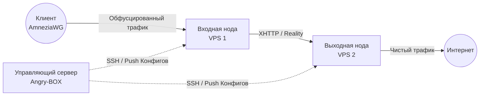

<div align="center">
  
  <h1>Angry-BOX</h1>
  <p><strong>Ультимативный автоматизированный оркестратор для sing-box-extended</strong></p>

  <p>
    <a href="https://github.com/AlexeyLCP/angry-box/releases"></a>
    <a href="https://golang.org"></a>
    <a href="LICENSE"></a>
  </p>
  <p>
    <i>Создавайте непробиваемые, сильно обфусцированные VPN-цепочки (multi-hop) с нулевой ручной настройкой.</i>
  </p>
</div>

---

**[🇬🇧 English](README.md) | [🇷🇺 Русский](README_ru.md) | [🇨🇳 简体中文](README_zh.md) | [🇮🇷 فارسی](README_fa.md)**

## 🚀 О проекте

**Angry-BOX** — это продвинутый и легковесный оркестратор, созданный для полной автоматизации развертывания, настройки и управления Anti-DPI прокси-нодами на множестве серверов.

Построенный эксклюзивно на базе **[sing-box-extended](https://github.com/shtorm-7/sing-box-extended)**, Angry-BOX автоматически и бесшовно конфигурирует сложнейшие топологии (например, цепочки серверов через `VLESS-Reality`, `XHTTP` и `AmneziaWG`) напрямую по протоколу SSH. Он избавляет от всей головной боли при создании отказоустойчивой и защищённой от блокировок инфраструктуры.

## ✨ Ключевые возможности

- **Автоматическая оркестрация:** Больше не нужно вручную писать сложные JSON-конфиги для `sing-box`. Angry-BOX генерирует, валидирует и разворачивает конфиги по SSH за считанные секунды.
- **Продвинутая обфускация:** Нативная поддержка современных протоколов `AmneziaWG`, `XHTTP`, `VLESS-Reality` и `Hysteria2`.
- **Цепочки Multi-Hop:** Легко стройте цепочки из 2 или 3 узлов (серверов) для маршрутизации трафика через разные юрисдикции и максимальной анонимности.
- **Failover и балансировка:** Встроенная поддержка стратегий `urltest`, `failover` и `selector`.
- **Современный Web UI:** Управляйте всем через красивую и адаптивную панель управления, написанную на HTMX и TailwindCSS (защищена встроенной аутентификацией).
- **100% Автономность:** Angry-BOX хранит все критически важные зависимости (бинарники ядра `sing-box-extended` и модуль ядра `amneziawg`) внутри себя. Ваши деплои не сломаются, даже если сторонние Github-репозитории станут недоступны.
- **Нулевой след (Zero-Footprint):** На серверах-нодах работает только чистое ядро `sing-box`. Оркестратор устанавливается исключительно на вашу управляющую машину.

## 📸 Скриншоты

<div align="center">
  
  <br>
  <em>Панель управления Angry-BOX</em>
</div>

## 🏗 Архитектура

В отличие от традиционных панелей, требующих установки тяжелых агентов (скриптов) на каждый сервер, Angry-BOX использует **stateless agentless (безагентный)** подход:



## 🛠 Быстрый старт

### 1. Установка

Скачайте последний релиз для вашей платформы (Linux/Windows/macOS) со страницы [Releases](https://github.com/AlexeyLCP/angry-box/releases), либо воспользуйтесь удобным скриптом установки:

```bash
curl -fsSL https://raw.githubusercontent.com/AlexeyLCP/angry-box/main/scripts/install.sh | sh
```

### 2. Запуск сервиса (Web UI)

Запустите Angry-BOX как сервис systemd или запустите вручную из консоли:

```bash
angry-box serve -listen 0.0.0.0:8090
```

*Примечание: При первом запуске для веб-интерфейса будет сгенерирован случайный надежный пароль. Проверьте консоль или логи (`journalctl -u angry-box`), чтобы узнать его.*

### 3. Быстрый старт через CLI

Вы можете управлять всей сетью исключительно через командную строку:

```bash
# 1. Добавляем VPS серверы
angry-box host add entry-node --addr 1.2.3.4:22 --user root --key ~/.ssh/id_ed25519
angry-box host add exit-node --addr 5.6.7.8:22 --user root --key ~/.ssh/id_ed25519

# 2. Устанавливаем ядро sing-box на эти серверы
angry-box deploy -addr 1.2.3.4 -key ~/.ssh/id_ed25519
angry-box deploy -addr 5.6.7.8 -key ~/.ssh/id_ed25519

# 3. Создаем цепочку с входом через AmneziaWG и транспортом XHTTP между серверами
angry-box chain create my-chain --nodes entry-node,exit-node --user-protocol awg --transport xhttp

# 4. Применяем конфигурацию (сгенерирует и отправит конфиги автоматически!)
angry-box apply-chain my-chain
```

После применения `angry-box` выведет **готовый клиентский блок настроек для AmneziaWG** прямо в консоль!

## 📜 Сторонние Open-Source компоненты и лицензии

Angry-BOX выступает в роли оркестратора и полагается на потрясающие технологии. Мы выражаем огромную благодарность следующим проектам:

- **[sing-box](https://github.com/SagerNet/sing-box)** и **[sing-box-extended](https://github.com/shtorm-7/sing-box-extended)** (Лицензия GPLv3)
- **[AmneziaWG Linux Kernel Module](https://github.com/amnezia-vpn/amneziawg-linux-kernel-module)** (Лицензия GPLv2)
- **HTMX, TailwindCSS и DaisyUI** (Лицензии MIT / BSD)

Пожалуйста, ознакомьтесь с файлом [LICENSE](LICENSE) для получения полных сведений о копирайтах и лицензиях.

## 📄 Лицензия

Этот проект лицензирован под **PolyForm Noncommercial License 1.0.0**.

**Это означает, что вы можете свободно использовать Angry-BOX в личных, образовательных и исследовательских целях.** 
*Любое коммерческое использование (например, продажа VPN-сервисов, построенных с помощью этого оркестратора, предоставление SaaS и т.д.) СТРОГО ЗАПРЕЩЕНО без прямого письменного разрешения автора.*
