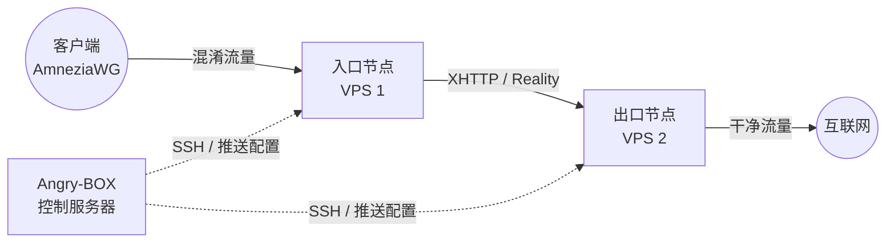

<div align="center">
  
  <h1>Angry-BOX</h1>
  <p><strong>适用于 sing-box-extended 的终极自动化代理编排器</strong></p>

  <p>
    <a href="https://github.com/AlexeyLCP/angry-box/releases"></a>
    <a href="https://golang.org"></a>
    <a href="LICENSE"></a>
  </p>
  <p>
    <i>构建坚不可摧的、高度混淆的多节点 (Multi-hop) VPN 代理链，零手动配置。</i>
  </p>
</div>

---

**[🇬🇧 English](README.md) | [🇷🇺 Русский](README_ru.md) | [🇨🇳 简体中文](README_zh.md) | [🇮🇷 فارسی](README_fa.md)**

## 🚀 概述

**Angry-BOX** 是一个先进的、轻量级的编排器，旨在完全自动化跨多个服务器的抗 DPI 代理节点的部署、配置和管理。

基于 **[sing-box-extended](https://github.com/shtorm-7/sing-box-extended)** 独家打造，Angry-BOX 通过 SSH 直接无缝配置复杂的代理拓扑（例如具有 `VLESS-Reality`、`XHTTP` 和 `AmneziaWG` 的多节点链路），消除了设置坚固、抗审查基础设施的所有摩擦。

## ✨ 特性

- **自动编排：** 无需手动编写复杂的 `sing-box` JSON 配置文件。Angry-BOX 可在几秒钟内通过 SSH 生成、验证和部署配置。
- **高级混淆协议：** 原生支持 `AmneziaWG`、`XHTTP`、`VLESS-Reality` 和 `Hysteria2`。
- **多节点链路 (Multi-Hop)：** 轻松构建 2 节点或 3 节点代理链，安全地通过多个司法管辖区路由流量，实现最大匿名性。
- **故障转移与负载均衡：** 内置支持 `urltest`、`failover` 和 `selector` 策略。
- **现代 Web UI：** 通过使用 HTMX 和 TailwindCSS 构建的时尚响应式仪表板控制一切（受自动身份验证保护）。
- **100% 独立：** Angry-BOX 将所有关键依赖项（如 `sing-box-extended` 二进制文件和 `amneziawg` 内核模块）本地存储。即使第三方仓库宕机，您的部署也不会受到影响。
- **零足迹 (Zero-Footprint)：** 节点服务器仅运行纯净的 `sing-box` 核心。编排器完全位于您的控制机上。

## 📸 屏幕截图

<div align="center">
  
  <br>
  <em>Angry-BOX Web UI 仪表板</em>
</div>

## 🏗 架构

与需要在每台服务器上运行沉重代理的传统面板不同，Angry-BOX 采用 **无状态、无代理 (stateless agentless)** 方法：



## 🛠 快速开始

### 1. 安装

从 [Releases](https://github.com/AlexeyLCP/angry-box/releases) 页面下载适合您平台 (Linux/Windows/macOS) 的最新版本，或运行便捷的安装脚本：

```bash
curl -fsSL https://raw.githubusercontent.com/AlexeyLCP/angry-box/main/scripts/install.sh | sh
```

### 2. 启动守护进程 (Web UI)

将 Angry-BOX 作为 systemd 服务运行，或手动启动它：

```bash
angry-box serve -listen 0.0.0.0:8090
```

*注意：首次运行时，将为 Web UI 生成一个随机的安全密码。请检查您的控制台日志或 `journalctl -u angry-box` 以找到它。*

### 3. CLI 快速入门

您可以完全通过 CLI 编排您的网络：

```bash
# 1. 添加您的 VPS 节点
angry-box host add entry-node --addr 1.2.3.4:22 --user root --key ~/.ssh/id_ed25519
angry-box host add exit-node --addr 5.6.7.8:22 --user root --key ~/.ssh/id_ed25519

# 2. 将 sing-box 核心部署到节点
angry-box deploy -addr 1.2.3.4 -key ~/.ssh/id_ed25519
angry-box deploy -addr 5.6.7.8 -key ~/.ssh/id_ed25519

# 3. 创建使用 AmneziaWG 入口和 XHTTP 传输的代理链
angry-box chain create my-chain --nodes entry-node,exit-node --user-protocol awg --transport xhttp

# 4. 应用该链以自动生成和推送配置！
angry-box apply-chain my-chain
```

Angry-BOX 将在控制台中直接输出一个 **随时可用 (ready-to-use) 的 AmneziaWG 客户端配置块**！

## 📜 第三方开源组件与许可证

Angry-BOX 是站在巨人的肩膀上构建的。我们要感谢以下使该编排器成为可能的优秀项目：

- **[sing-box](https://github.com/SagerNet/sing-box)** 和 **[sing-box-extended](https://github.com/shtorm-7/sing-box-extended)** (在 GPLv3 许可证下发布) - *非常感谢扩展核心！*
- **[AmneziaWG Linux 内核模块](https://github.com/amnezia-vpn/amneziawg-linux-kernel-module)** (在 GPLv2 许可证下发布)
- **[pumbaX 的 awg-multi-script](https://github.com/pumbaX/awg-multi-script)** - *感谢其在 AmneziaWG 混淆最佳实践方面的出色研究，这启发了我们的默认预设。*
- **HTMX, TailwindCSS, 以及 DaisyUI** (MIT / BSD 许可证)

请参阅 [LICENSE](LICENSE) 文件以获取完整的版权声明和许可详细信息。

## 📄 许可证

本项目基于 **PolyForm Noncommercial License 1.0.0** 授权。

**这意味着您可以出于个人、教育和研究目的自由使用 Angry-BOX。**
*未经作者直接书面许可，严禁将此编排器用于任何商业用途（例如，销售基于此编排器的 VPN 服务、提供 SaaS 等）。*
